# rest-mail mobile

The iOS and Android client for
[rest-mail](https://github.com/rest-mail/rest-mail-server). One Flutter app
builds for both platforms. It talks to the server over the same REST API the
webmail uses, not IMAP.

## What it does

- Signs in with an email address and password, plus a TOTP or recovery code
  when the account has two-factor authentication. It finds the server from the
  address's domain, or you can enter the server address yourself.
- Folders, message lists, reading, reply, reply all, forward, drafts, search
  and attachments. You can also link other mailboxes on the same server and
  switch between them.
- Live updates over the server's event stream while the app is open.
- HTML mail is cut down to the webmail's allowlist and drawn as native
  widgets. There is no web view and no JavaScript. Remote images stay blocked
  until you tap Load.
- HTTPS only. The app has no setting that turns off certificate checks.

## Walkthrough

These screens come from `chore screens`, which drives the app against the
in-memory rest-mail in `packages/restmail_fake`. The account is
`dana@restmail.test` with its sample mail.

<table>
<tr>
<td valign="top" width="260">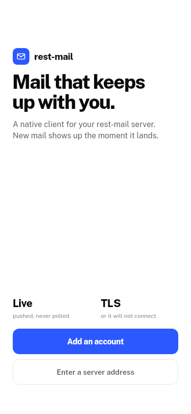</td>
<td valign="top">

### Welcome

The first launch has two ways in. **Add an account** starts from an email
address. **Enter a server address** is for a server that can't be found from
the domain. On the **Server** screen you type the address and tap **Test**,
which checks that rest-mail answers over HTTPS. **Use this server** only works
once the test passes. A plain `http://` address is refused.

</td>
</tr>
<tr>
<td valign="top" width="260">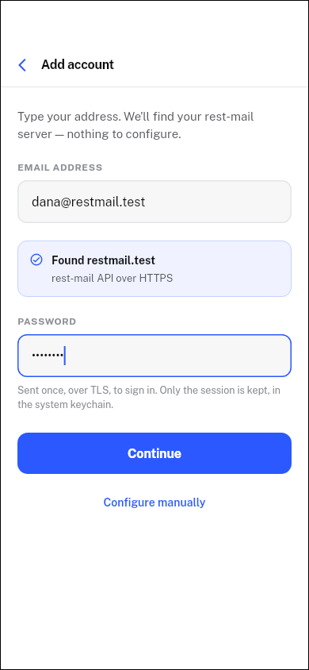</td>
<td valign="top">

### Adding an account

About half a second after you stop typing the domain, the app looks for a
rest-mail server at the domain and at `mail.<domain>`, and the card under the
address shows the result. If nothing is found, **Configure manually** opens the
Server screen. The password is sent once, to sign in. After that the app keeps
only the session, in the system keychain.

If the account has two-factor authentication, a **Two-factor code** field
appears. **Use a recovery code instead** switches it to take a recovery code.

</td>
</tr>
<tr>
<td valign="top" width="260">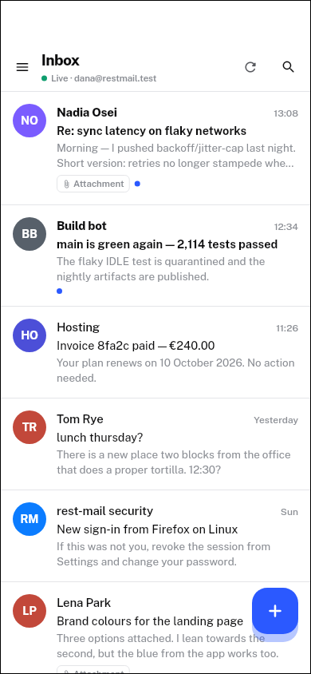</td>
<td valign="top">

### Inbox

The line under the folder name shows the connection: **Live** while the
server's event stream is up, **Connecting…** or **Offline · retrying**
otherwise. New mail arrives without a refresh.

- A blue dot marks unread mail, and an **Attachment** tag marks mail with
  files.
- Pull down or tap refresh to reload. Older mail loads as you scroll.
- Swipe left to move a message to Trash, with **Undo**. In Trash, swiping
  asks first, because the message is then deleted for good.
- Tap **+** to write a new message. Tapping a draft opens it for editing.

</td>
</tr>
<tr>
<td valign="top" width="260">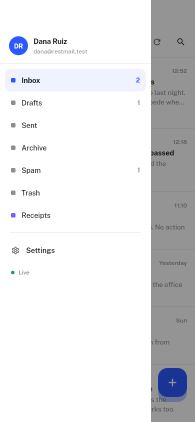</td>
<td valign="top">

### Folders and accounts

The menu button opens the drawer. Each folder shows its unread count, and
Drafts shows how many drafts there are. Folders the server has beyond the
standard ones, like **Receipts** here, are listed too. If you have linked other
mailboxes, their avatars sit next to the account at the top; tap one to switch
to it. **Settings** is at the bottom.

</td>
</tr>
<tr>
<td valign="top" width="260">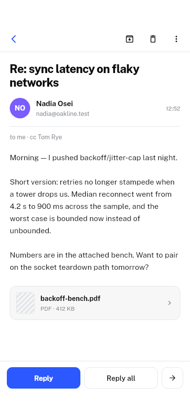</td>
<td valign="top">

### Reading a message

Opening a message marks it read. Tap the recipient line to see full addresses
and the date.

- The top bar has **Archive** and **Delete**. The **⋮** menu has **Mark as
  unread**, **Flag** and **Move to Spam** (**Not spam** when the message is in
  Spam). Moves can be undone.
- Tap an attachment to download it and open the share sheet. When there are
  several, a card opens a grid of them.
- **Reply** is always there. **Reply all** appears when other people are on
  the message, and the arrow is **Forward**.

</td>
</tr>
<tr>
<td valign="top" width="260">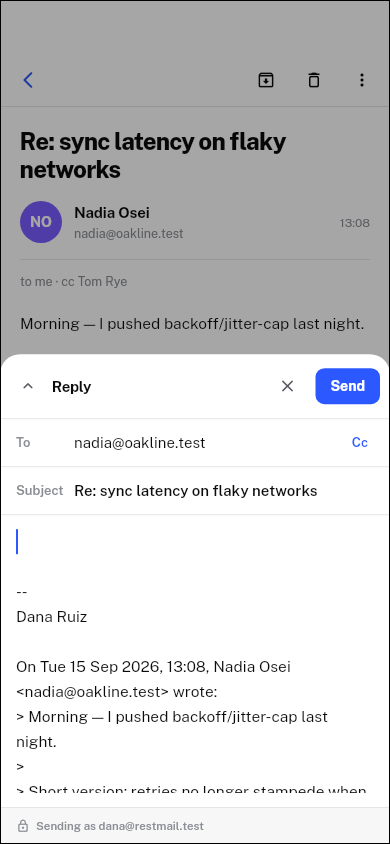</td>
<td valign="top">

### Replying

Compose opens as a sheet over the message. Reply adds `Re:` and quotes the
original. Forward adds `Fwd:` and the forwarded message. **Cc** reveals the Cc
and Bcc fields, and **From** appears when you have more than one mailbox. The
chevron makes the sheet full height. If you close it with changes, the app
asks whether to keep a draft; tapping outside the sheet doesn't close it.

New messages always get your signature. Replies and forwards get it only if
**Append on replies** is on, as it is here.

</td>
</tr>
<tr>
<td valign="top" width="260">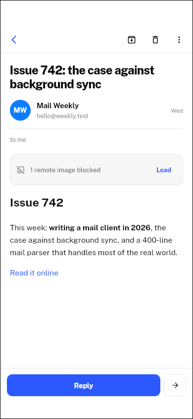</td>
<td valign="top">

### HTML mail

HTML mail is drawn as native widgets, not in a web view. Scripts, styles and
forms are removed. Remote images are blocked, and a bar counts them until you
tap **Load**. Links open only if they are `http`, `https` or `mailto`; a
`mailto` link opens compose.

</td>
</tr>
<tr>
<td valign="top" width="260">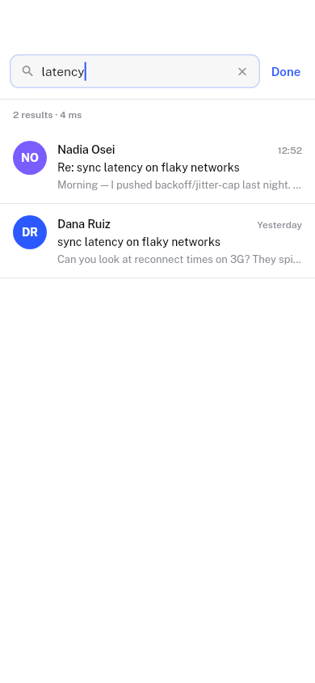</td>
<td valign="top">

### Search

Results update as you type and show how long the server took. Before you type,
the screen suggests `has:attachment`, `in:sent` and `from:`, then lists recent
searches. Recent searches are kept only until the app closes.

| Term | Matches |
|---|---|
| `from:<text>` | the sender |
| `in:<folder>` | one folder; standard folder names ignore case |
| `has:attachment` | mail with files |
| anything else | free text |

</td>
</tr>
<tr>
<td valign="top" width="260">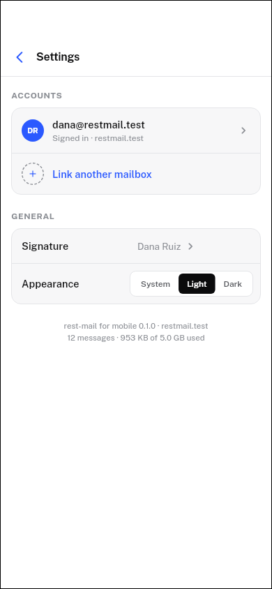</td>
<td valign="top">

### Settings

- **Accounts** lists the signed-in account and any linked mailboxes. Tap one
  to see its display name, server and storage, and to **Sign out**, or
  **Remove from this session** for a linked mailbox. Signing out removes the
  session from the phone; the mail stays on the server.
- **Link another mailbox** adds another mailbox on the same server to this
  session.
- **Signature** edits the signature, with a preview and the **Append on
  replies** switch.
- **Appearance** is **System**, **Light** or **Dark**.

Settings are stored only on the device.

</td>
</tr>
</table>

### Dark

Every screen also has a dark version:

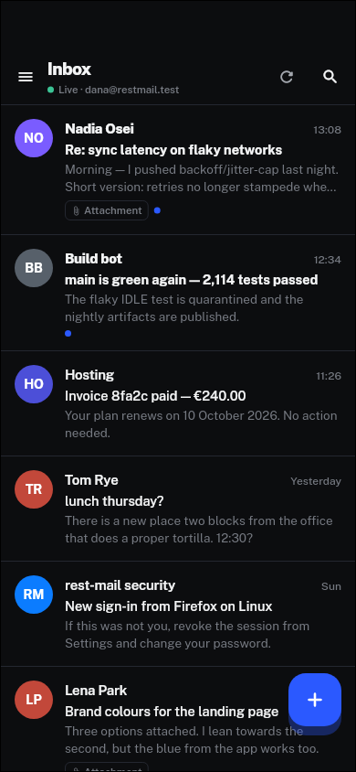 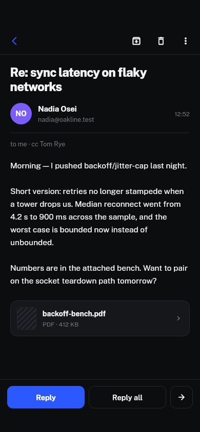 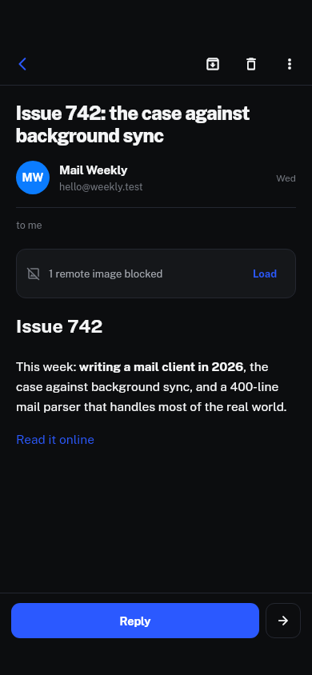

## Layout

| Path | What |
|---|---|
| `lib/` | The app |
| `packages/restmail_api/` | The REST client as a plain Dart package: sign-in and token refresh, mail, the event stream, server discovery. It has no Flutter code, so its tests run with `dart test`. |
| `packages/restmail_fake/` | An in-memory rest-mail that speaks the same API, for tests and for running the app with no server |
| `tool/screens/` | Draws every screen against the fake, for looking at |
| `assets/fonts/` | Public Sans (SIL Open Font License) |

## Development

You need Flutter 3.47.1 (stable), Xcode 26 for iOS, and the Android SDK
(platform 36) with JDK 17 or 21 for Android. CocoaPods is not needed: every
plugin resolves through Swift Package Manager.

```sh
chore get      # dependencies for the app and both packages
chore check    # format, analyze and test everything, as CI does
flutter run
```

### Sample mail, no server

`chore run:sample` runs the app against the in-memory rest-mail in
`packages/restmail_fake`. Every screen works, on a simulator or a phone,
with no server anywhere. Sign in as `dana@restmail.test` with the password
`restmail`; the sign-in screen shows these as well. `SCENARIO=empty`
starts with no mail. `SCENARIO=twoFactor` asks for the code `123456`. Only
debug builds can do this.

`chore sim:sample` builds the same thing and starts it in the iOS simulator,
booting one first if none is running, with no terminal left attached. The
sign-in screen comes up filled in, so it is one tap to the mailbox.

`chore screens` walks the app through its screens in light and dark
against the same fake, and saves a picture of each in `build/screens/`.
The pictures in `media/` are copies of these, used in the walkthrough above.
Copy them over again when a screen changes.

### Against a local testbed

The testbed signs its certificates with its own CA. You can tell a debug build
to trust that CA:

```sh
mkdir -p .dev
python3 -c 'import json,sys; print(json.dumps({"RESTMAIL_DEV_CA": open(sys.argv[1]).read()}))' \
  path/to/testbed-ca.crt > .dev/testbed.json
flutter run --dart-define-from-file=.dev/testbed.json
```

Profile and release builds ignore this define. The simulator or emulator also
has to resolve the testbed's host names.

### Against a stack behind ddt

When rest-mail runs locally behind [ddt](https://github.com/antimatter-studios/docker-dev-tools),
its proxy serves `https://restmail.localhost` with a certificate from ddt's own
CA. `chore sim:local` does the above with that CA (`ddt ca path`) and starts the
debug build in the iOS simulator; add the account with the server
`https://restmail.localhost`. Nothing is added to the Mac's or the simulator's
trust store: only this debug build trusts the CA, and it still checks every
certificate against it.

## Identity

The app ID is `com.antimatterstudios.restmail` on both platforms. It ships
under Apple Developer team `43UMKXZ8P4`.

## Not yet

- Notifications while the app is closed. The server needs to push through
  APNs and FCM first.
- Sending attachments. The send API has no field for them.
- Contacts, vacation replies, Sieve filters, quarantine and administration.
